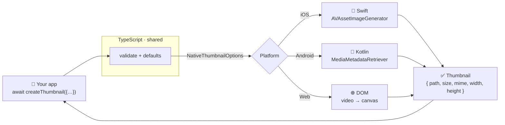

<div align="center">

# 🎬 react-native-nitro-thumbnail

### Generate a thumbnail from any video — local or remote — with one async call.

**The same API on iOS, Android, and Web.** Powered by [Nitro](https://nitro.margelo.com/):
pure **Swift** & **Kotlin**, New Architecture, no bridge.

<br/>

[](https://www.npmjs.com/package/react-native-nitro-thumbnail)
[](https://www.npmjs.com/package/react-native-nitro-thumbnail)
[](./LICENSE)
[](./src/types.ts)

[](#-platform-support)
[](https://reactnative.dev/architecture/landing-page)
[](https://nitro.margelo.com/)
[](./CONTRIBUTING.md)

</div>

```ts
import { createThumbnail } from 'react-native-nitro-thumbnail';

const thumb = await createThumbnail({ url: 'https://media.example.com/clip.mp4' });
// → { path: 'file:///…/thumb-xyz.jpg', size: 19856, mime: 'image/jpeg', width: 512, height: 288 }

<Image source={{ uri: thumb.path }} />
```

That's the whole API. One function. It works the same whether the video is a
`file://` on disk or an `https://` URL behind auth headers, and whether you're on
an iPhone, an Android tablet, or in a browser.

---

## 🎥 See it in action

<div align="center">

<video src="https://raw.githubusercontent.com/pythonsst/react-native-nitro-thumbnail/main/example/assets/sample.mp4" poster="https://raw.githubusercontent.com/pythonsst/react-native-nitro-thumbnail/main/docs/assets/demo-thumbnail.jpg" controls muted loop width="720"></video>

<p><em>▶︎ Press play — a 2K clip. (<a href="https://raw.githubusercontent.com/pythonsst/react-native-nitro-thumbnail/main/example/assets/sample.mp4">Open the video</a> if it doesn't load inline.)</em></p>

<br/>

**…and here's the thumbnail `createThumbnail()` extracts from it** — one call,
one frame, scaled and encoded to a crisp 1280×546 JPEG:


</div>

```ts
const thumb = await createThumbnail({ url, timeStamp: 2000, maxWidth: 1280 });
// → { path: '…/thumb.jpg', size: 95_072, mime: 'image/jpeg', width: 1280, height: 546 }
```

> Demo clip: **[Sintel](https://www.sintel.org)** © Blender Foundation, licensed
> [CC-BY 3.0](https://creativecommons.org/licenses/by/3.0/). Bundled in
> [`example/`](./example) so you can run the demo yourself.

---

## ✨ Why this library?

<table>
<tr>
<td width="50%" valign="top">

**🧩 One API, three engines**
iOS (`AVFoundation`), Android (`MediaMetadataRetriever`), and Web
(`<video>` + `<canvas>`) all behind a single typed function. Your call sites
never branch on platform.

**🌐 Local & remote, no download step**
Pass a `file://` path or an `http(s)` URL. Remote videos are **streamed and
decoded directly** — only the bytes needed to reach your frame. Custom request
`headers` (e.g. `Authorization`) are supported.

**⚡ Built on Nitro**
Pure Swift & Kotlin over JSI — no Objective-C/Java bridge, no JSON marshalling.
The native contract is **generated** from one TypeScript spec, so it can't drift.

</td>
<td width="50%" valign="top">

**🎯 Typed errors, not opaque strings**
Every failure rejects with a `ThumbnailError` carrying a typed `.code`
(`FILE_NOT_FOUND`, `REMOTE_FETCH_FAILED`, …) you can `switch` on.

**💾 Built-in caching**
Deterministic filenames (`cacheName`) skip re-decoding entirely; a size cap
(`dirSize`) evicts old thumbnails (LRU) so the cache never grows unbounded.

**🔀 Drop-in replacement**
Matches [`react-native-create-thumbnail`](https://www.npmjs.com/package/react-native-create-thumbnail)'s
options, result shape, defaults, and exports — migrating is usually a one-line
import change.

</td>
</tr>
</table>

---

## 🗺️ How it works

One TypeScript function validates your input and applies defaults, then calls a
Nitro `HybridObject` implemented natively per platform. The box labelled "your
app" never changes — only the engine behind it does.



The complete request lifecycle — cache check, decode, encode, write, evict — is
documented in **[docs/architecture.md](./docs/architecture.md)**.

---

## 📦 Installation

```sh
npm install react-native-nitro-thumbnail react-native-nitro-modules
# or
yarn add react-native-nitro-thumbnail react-native-nitro-modules
```

`react-native-nitro-modules` is a **required peer dependency** — it provides the
Nitro runtime.

**iOS** — install pods:

```sh
cd ios && pod install
```

**Expo** — this is a native module, so it needs an **Expo dev build** (it does
**not** run in Expo Go). No config plugin required:

```sh
npx expo install react-native-nitro-thumbnail react-native-nitro-modules
npx expo prebuild && npx expo run:ios   # or run:android
```

> Requires **React Native 0.75+** with the **New Architecture** enabled.

---

## 🚀 Quick start

```ts
import { createThumbnail, ThumbnailError } from 'react-native-nitro-thumbnail';

async function makeThumb(videoUri: string) {
  try {
    const thumb = await createThumbnail({
      url: videoUri,     // 'file:///…' or 'https://…'
      timeStamp: 1000,   // grab the frame at 1.0s (milliseconds)
      format: 'jpeg',    // 'jpeg' | 'png'
      maxWidth: 512,     // fit within 512×512, aspect preserved, never upscaled
      maxHeight: 512,
      quality: 0.9,      // jpeg quality 0..1 (ignored for png)
    });

    return thumb.path;   // → <Image source={{ uri: thumb.path }} />
  } catch (e) {
    if (e instanceof ThumbnailError) {
      console.warn(`thumbnail failed [${e.code}]: ${e.message}`);
    }
    throw e;
  }
}
```

---

## 📱 Platform support

| Platform | Engine | Minimum | Notes |
|---|---|---|---|
| 🍎 **iOS** | `AVAssetImageGenerator` | iOS 13 | async `image(at:)` on iOS 16+, `copyCGImage` fallback below |
| 🤖 **Android** | `MediaMetadataRetriever` | minSdk 24 | `getScaledFrameAtTime` on API 27+, scale-after fallback below |
| 🌐 **Web** | `<video>` → `<canvas>` → `toBlob` | modern browsers | resolved automatically via `index.web.ts` |

Requires React Native **0.75+** with the **New Architecture** enabled.

---

## 🧰 API at a glance

```ts
createThumbnail(options: CreateThumbnailOptions): Promise<Thumbnail>
```

<details open>
<summary><b>Options</b></summary>

| Option | Type | Default | Description |
|---|---|---|---|
| `url` | `string` | **required** | Local `file://`/absolute path, or an `http(s)` URL. |
| `timeStamp` | `number` | `0` | Frame time in **milliseconds**. |
| `format` | `'jpeg' \| 'png'` | `'jpeg'` | Output format. |
| `maxWidth` | `number` | `512` | Max width — aspect preserved, never upscaled. |
| `maxHeight` | `number` | `512` | Max height — aspect preserved, never upscaled. |
| `quality` | `number` | `0.9` | JPEG quality `0..1` (clamped). Ignored for PNG. |
| `cacheName` | `string` | — | Deterministic filename; existing file returned **without re-decoding**. |
| `dirSize` | `number` | `100` | Cache cap in **MB** (LRU eviction). |
| `headers` | `Record<string,string>` | — | HTTP headers for remote fetches. |
| `timeToleranceMs` | `number` | `2000` | How far from `timeStamp` a frame may be picked. |
| `onlySyncedFrames` | `boolean` | `true` | Prefer the nearest keyframe (faster). |

</details>

<details>
<summary><b>Result — <code>Thumbnail</code></b></summary>

```ts
interface Thumbnail {
  path: string;   // native: file:// URL · web: blob: object URL
  size: number;   // file size in bytes
  mime: string;   // 'image/jpeg' | 'image/png'
  width: number;  // actual output width  (≤ maxWidth)
  height: number; // actual output height (≤ maxHeight)
}
```

</details>

<details>
<summary><b>Errors — <code>ThumbnailError.code</code></b></summary>

`INVALID_URL` · `FILE_NOT_FOUND` · `REMOTE_FETCH_FAILED` · `DECODE_FAILED` ·
`UNSUPPORTED_FORMAT` · `WRITE_FAILED` · `UNKNOWN`

Full descriptions in **[docs/error-handling.md](./docs/error-handling.md)**.

</details>

Full reference: **[docs/api-reference.md](./docs/api-reference.md)**.

---

## 💡 Examples

**Remote video with auth headers**

```ts
const thumb = await createThumbnail({
  url: 'https://media.example.com/clips/abc.mp4',
  headers: { Authorization: `Bearer ${token}` },
  timeStamp: 2000,
});
```

**PNG output**

```ts
const thumb = await createThumbnail({ url, format: 'png' }); // quality ignored
```

**Deterministic cache — decode once, reuse forever**

```ts
// First call decodes and writes thumbnails/poster-42.jpg
await createThumbnail({ url, cacheName: 'poster-42' });
// Subsequent calls (even after restart) return it instantly — no decode
const cached = await createThumbnail({ url, cacheName: 'poster-42' });
```

**Typed error handling**

```ts
try {
  await createThumbnail({ url });
} catch (e) {
  if (e instanceof ThumbnailError && e.code === 'REMOTE_FETCH_FAILED') {
    // offer a retry
  }
}
```

There's a runnable demo (local + remote, on a button tap) in
**[`example/`](./example)**.

---

## 🔀 Migrating from `react-native-create-thumbnail`

It's a drop-in replacement — in most apps the switch is just the import:

```diff
- import { createThumbnail } from 'react-native-create-thumbnail';
+ import { createThumbnail } from 'react-native-nitro-thumbnail';
```

Same options, same result, same defaults, both import styles. The differences:
typed `ThumbnailError.code`, a stricter `headers` type, a new `quality` option,
**and** it runs on Web. New-Architecture-only and needs
`react-native-nitro-modules`. Full guide: **[docs/migration.md](./docs/migration.md)**.

---

## 📚 Documentation

There's a full **documentation site** (Nextra) in [`website/`](./website) — landing
page, sidebar nav, search, dark mode, and rendered diagrams. Run it with
`cd website && npm install && npm run dev`, or deploy it to Vercel (see
[website/README.md](./website/README.md)).

The same content also lives as deep, diagram-rich guides in **[`docs/`](./docs)**:

| Guide | What's inside |
|---|---|
| 🏛️ [Architecture](./docs/architecture.md) | The TS → Nitro → native flow, the four layers, full request lifecycle. |
| 📖 [API Reference](./docs/api-reference.md) | Every option & result field, with recipes. |
| ⚠️ [Error Handling](./docs/error-handling.md) | The seven codes + the `[CODE]`-prefix bridging trick. |
| 💾 [Caching](./docs/caching.md) | `cacheName` dedup + `dirSize` LRU eviction, explained. |
| 🍎 [iOS](./docs/platforms/ios.md) · 🤖 [Android](./docs/platforms/android.md) · 🌐 [Web](./docs/platforms/web.md) | Annotated native implementations. |
| 🔀 [Migration](./docs/migration.md) | Switching from `react-native-create-thumbnail`. |
| 🛠️ [Internals & Contributing](./docs/internals.md) | Build pipeline, repo layout, testing, how to hack on it. |

Start with **[Architecture](./docs/architecture.md)** — everything else zooms in
on it.

---

## 🤝 Contributing

Contributions of every size are welcome — and a great first PR is improving a doc
you found confusing while reading the [`docs/`](./docs).

- 🛠️ [How the project is built & how to make a change](./docs/internals.md)
- 📋 [Development workflow](./CONTRIBUTING.md#development-workflow) · [Sending a pull request](./CONTRIBUTING.md#sending-a-pull-request)
- 🤗 [Code of conduct](./CODE_OF_CONDUCT.md)
- 🐛 [Open an issue](https://github.com/pythonsst/react-native-nitro-thumbnail/issues)

```sh
yarn            # install (Yarn 4 workspaces)
yarn nitrogen   # regenerate native specs after editing *.nitro.ts
yarn test       # Jest (TypeScript layer)
yarn typecheck  # tsc
yarn lint       # eslint
```

If you find this useful, a ⭐ on the repo genuinely helps others discover it.

---

## 📄 License

[MIT](./LICENSE) © contributors

<div align="center">
<sub>Built with <a href="https://nitro.margelo.com/">Nitro Modules</a> · scaffolded with <a href="https://github.com/callstack/react-native-builder-bob">create-react-native-library</a></sub>
</div>
