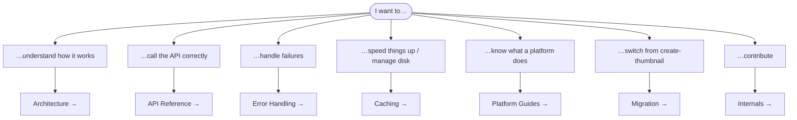
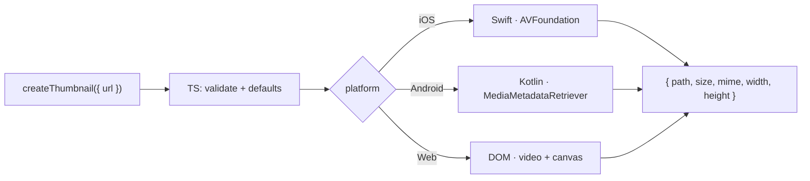

# 📚 Documentation

Welcome to the deep docs for **react-native-nitro-thumbnail**. The
[project README](../README.md) is the quick start; these guides are the *why* and
the *how*.

---

## Guides

| Guide | What's inside | Read it when |
|---|---|---|
| 🏛️ **[Architecture](./architecture.md)** | The TS → Nitro → native flow, the four layers, full request lifecycle, design principles. | You want the mental model behind everything. |
| 📖 **[API Reference](./api-reference.md)** | Every option, the result shape, the error class, and quick recipes. | You're writing a `createThumbnail` call. |
| ⚠️ **[Error Handling](./error-handling.md)** | The seven error codes and the `[CODE]`-prefix trick that bridges native errors to a typed `.code`. | A call is failing, or you're adding error handling. |
| 💾 **[Caching](./caching.md)** | `cacheName` dedup and `dirSize` LRU eviction, how they compose, and tuning advice. | You're rendering lists or worried about disk. |
| 📱 **Platform deep dives** | What each engine actually does, with the real native code annotated. | You want to know how iOS/Android/Web differ. |
| 🔀 **[Migration](./migration.md)** | Moving from `react-native-create-thumbnail` — the one-line change and the few differences. | You're switching libraries. |
| 🛠️ **[Internals & Contributing](./internals.md)** | Repo layout, the bob+nitrogen build pipeline, testing strategy, how to make a change. | You want to hack on the library. |

### Platform deep dives

| Platform | Engine | Guide |
|---|---|---|
| 🍎 iOS | `AVAssetImageGenerator` (Swift) | **[platforms/ios.md](./platforms/ios.md)** |
| 🤖 Android | `MediaMetadataRetriever` (Kotlin) | **[platforms/android.md](./platforms/android.md)** |
| 🌐 Web | `<video>` + `<canvas>` (DOM) | **[platforms/web.md](./platforms/web.md)** |

---

## A 60-second tour

- **One function**, three native engines, identical results — see
  [Architecture](./architecture.md).
- **Typed errors**: every failure is a `ThumbnailError` with a `.code` — see
  [Error Handling](./error-handling.md).
- **Built-in caching**: decode once, cap disk usage — see [Caching](./caching.md).
- **Drop-in** for `react-native-create-thumbnail` — see [Migration](./migration.md).

New here? Read **[Architecture](./architecture.md)** first; everything else is a
zoom-in on it.
