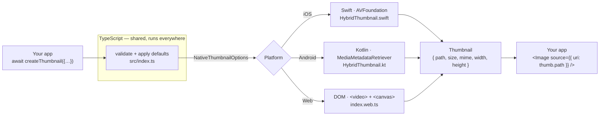
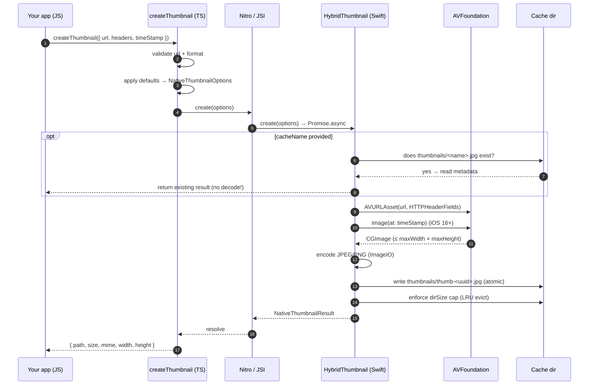

# Architecture

> How a single `createThumbnail()` call becomes a decoded video frame on three
> very different platforms — and why the library is built the way it is.

If you only read one design doc, read this one. Everything else
([caching](./caching.md), [error handling](./error-handling.md), the
[platform guides](./platforms/)) is a zoom-in on a box you'll meet here.

---

## The one-paragraph version

There is **one** public function — `createThumbnail(options)` — written in
TypeScript. It validates input and fills in defaults, then hands a fully-formed
options object to a **Nitro [`HybridObject`](https://nitro.margelo.com/docs/hybrid-objects)**.
That HybridObject is implemented in **Swift** on iOS, **Kotlin** on Android, and
**plain DOM APIs** on Web. Each implementation decodes a frame using the best
native API for its platform, encodes it to JPEG/PNG, and returns a small,
identical result object. Errors from any layer are funnelled back into a single
typed `ThumbnailError`.



The promise of the library: **the box labelled "Your app" never changes**. Only
the middle box changes per platform, and you never see it.

---

## Why Nitro?

React Native has historically bridged JS ↔ native through an asynchronous,
JSON-serialised "bridge". [Nitro Modules](https://nitro.margelo.com/) replaces
that with **JSI-backed `HybridObject`s**: typed, synchronous-capable, codegen'd
objects that call straight into Swift/Kotlin with no serialization tax.

For a thumbnail library that matters because:

| Concern | Old bridge | Nitro |
|---|---|---|
| **Type safety** | hand-written, drifts | generated from one `.nitro.ts` spec |
| **Language** | Obj-C / Java glue | pure **Swift** / **Kotlin** |
| **Marshalling** | JSON serialize both ways | direct JSI, zero-copy where possible |
| **Architecture** | old + new | **New Architecture only** |

The trade-off — and it's a deliberate one — is that the library is
**New-Architecture-only** and requires `react-native-nitro-modules` as a peer
dependency. See [internals](./internals.md) for the build pipeline this implies.

---

## The four layers

### 1. The public API (TypeScript, shared)

[`src/index.ts`](../src/index.ts) is the only entry point. It does three things,
in order, and nothing else:

1. **Validates** the inputs that are cheap to check in JS — `url` must be a
   non-empty string (`INVALID_URL`), `format` must be `'jpeg'` or `'png'`
   (`UNSUPPORTED_FORMAT`). Failing fast here means a malformed call never even
   crosses into native code.
2. **Applies defaults**, producing a `NativeThumbnailOptions` object where every
   field is present and normalized (e.g. `quality` is clamped to `0..1`,
   `timeStamp` defaults to `0`). Native code therefore never has to reason about
   `undefined`.
3. **Delegates** to `getThumbnailNative().create(normalized)` and wraps any
   rejection in `toThumbnailError`.

```ts
// the whole contract, paraphrased
const normalized = { url, timeStamp: 0, format: 'jpeg', maxWidth: 512,
                     maxHeight: 512, dirSize: 100, timeToleranceMs: 2000,
                     onlySyncedFrames: true, quality: 0.9, ...overrides };
try {
  return await getThumbnailNative().create(normalized);
} catch (e) {
  throw toThumbnailError(e); // → typed ThumbnailError
}
```

> **Why normalize in JS and not native?** Defaults written once in TypeScript
> can't drift between iOS and Android. The native side stays dumb and
> deterministic: it receives a complete struct and acts on it.

### 2. The Nitro spec (the contract)

[`src/specs/Thumbnail.nitro.ts`](../src/specs/Thumbnail.nitro.ts) is the single
source of truth for the JS↔native boundary:

```ts
export interface Thumbnail extends HybridObject<{ ios: 'swift'; android: 'kotlin' }> {
  create(options: NativeThumbnailOptions): Promise<NativeThumbnailResult>;
}
```

Running `nitrogen` over this file generates the Swift `HybridThumbnailSpec`
protocol, the Kotlin `HybridThumbnailSpec` abstract class, and the C++ glue that
wires them to JSI. **You implement the generated spec; you never write the
bridge.** Change the `.nitro.ts` file, re-run nitrogen, and both native sides get
a new compile-checked signature for free.

### 3. The native implementations (per platform)

This is the only layer that differs by platform. Each implements the same
`create()` method and returns the same shape.

| Platform | File | Decoder |
|---|---|---|
| iOS | [`ios/HybridThumbnail.swift`](../ios/HybridThumbnail.swift) | `AVAssetImageGenerator` |
| Android | [`android/.../HybridThumbnail.kt`](../android/src/main/java/com/margelo/nitro/nitrothumbnail/HybridThumbnail.kt) | `MediaMetadataRetriever` |
| Web | [`src/index.web.ts`](../src/index.web.ts) | `<video>` → `<canvas>` |

They share a common shape of work — **dedup → open → decode → encode → write →
evict** — explored in [The request lifecycle](#the-request-lifecycle) below and
in each [platform guide](./platforms/).

> **How does Web fit in?** Web has no Nitro layer. Metro's platform-extension
> resolution picks `index.web.ts` over `index.ts` when bundling for web, so the
> *same import* (`from 'react-native-nitro-thumbnail'`) resolves to a pure-DOM
> implementation. The public function signature is byte-for-byte identical.

### 4. Error normalization (shared)

Nitro surfaces only an error **message string** to JS — there's no structured
error object crossing the boundary. So the native side encodes the error code as
a `[CODE] message` prefix, and [`src/errors.ts`](../src/errors.ts) parses it back
into a typed `ThumbnailError`. This is important enough to get
[its own document](./error-handling.md).

---

## The request lifecycle

Here's a complete successful call to a **remote** video on **iOS**, end to end.
Other platforms follow the same beats with different native calls.



Read the numbered steps as the contract each platform upholds:

1–4. **Cheap JS validation, then a single native call.** Nothing reaches native
unless it's well-formed.

5. **Cache short-circuit.** If `cacheName` names an existing file, we return its
metadata and *never touch the decoder*. (See [caching](./caching.md).)

6–8. **Open + decode at the requested timestamp,** scaled down to fit
`maxWidth × maxHeight` without upscaling. The decoder does the scaling where it
can (e.g. `getScaledFrameAtTime` on Android, `maximumSize` on iOS) so we never
hold a full-resolution frame longer than necessary.

9–11. **Encode, write atomically, then evict** the oldest thumbnails if the
directory exceeds `dirSize` MB.

12–14. **Resolve** with a small plain object.

---

## Design principles

These are the invariants the whole codebase is organized around. If you send a
PR, these are what review will hold it to.

- **One API, three engines.** The public surface is defined once. Platform code
  is an implementation detail that must never leak into the type signatures.
- **Validate early, act dumbly.** All "is this input sane?" logic lives in
  TypeScript. Native code receives a complete, normalized struct and executes it
  without branching on missing values.
- **Pure logic is extracted and unit-tested.** Sizing math and LRU eviction live
  in side-effect-free helpers — [`ThumbnailEncoder.swift`](../ios/ThumbnailEncoder.swift),
  [`ThumbnailEncoderKt.kt`](../android/src/main/java/com/margelo/nitro/nitrothumbnail/ThumbnailEncoderKt.kt),
  and `fitSize` in [`index.web.ts`](../src/index.web.ts) — so they can be tested
  without a device, simulator, or video file.
- **Never upscale.** A thumbnail is always `≤ maxWidth × maxHeight`; small source
  videos are returned at their native size. The `width`/`height` in the result
  are the *actual* output dimensions, not the requested bounds.
- **Typed failure, never a silent one.** Every failure path maps to one of seven
  [`ThumbnailErrorCode`](./error-handling.md#the-error-codes)s.

---

## Where to go next

- **[API Reference](./api-reference.md)** — every option and result field.
- **[Error handling](./error-handling.md)** — the `[CODE]` bridging trick in detail.
- **[Caching](./caching.md)** — dedup and LRU eviction internals.
- **Platform deep dives** — [iOS](./platforms/ios.md) · [Android](./platforms/android.md) · [Web](./platforms/web.md).
- **[Internals & contributing](./internals.md)** — the build pipeline, repo layout, and how to hack on it.
