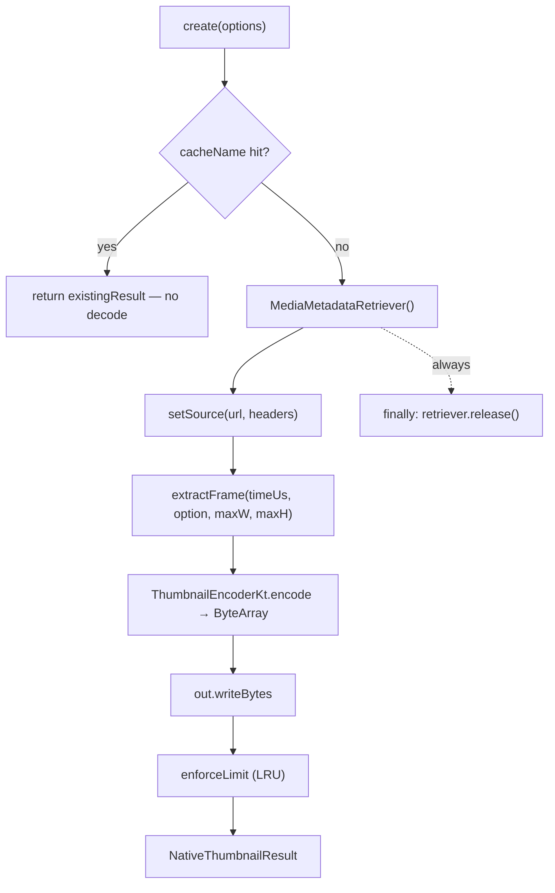

# Android Implementation

> Pure Kotlin, `MediaMetadataRetriever`, `BitmapFactory`. No Java bridge.

**Source:** [`HybridThumbnail.kt`](../../android/src/main/java/com/margelo/nitro/nitrothumbnail/HybridThumbnail.kt) ·
[`ThumbnailEncoderKt.kt`](../../android/src/main/java/com/margelo/nitro/nitrothumbnail/ThumbnailEncoderKt.kt)
**Decoder:** `MediaMetadataRetriever`
**Minimum:** minSdk 24 (`getScaledFrameAtTime` used on API 27+, scale-after fallback below)

---

## The pipeline

`HybridThumbnail` extends the nitrogen-generated `HybridThumbnailSpec()` and runs
its work inside `Promise.async { … }`. The `MediaMetadataRetriever` is always
released in a `finally` block — it holds native decoder resources.



---

## Pointing at the source

`setSource(retriever, url, headers)` handles local and remote uniformly:

```kotlin
when {
  raw.startsWith("http://") || raw.startsWith("https://") -> {
    try {
      retriever.setDataSource(raw, headers ?: emptyMap())   // ← custom headers
    } catch (e: Exception) {
      throw err("REMOTE_FETCH_FAILED", "Could not fetch remote video: ${e.message}")
    }
  }
  else -> {
    val path = when {
      raw.startsWith("file://") -> Uri.parse(raw).path ?: raw.removePrefix("file://")
      raw.startsWith("/")       -> raw
      else -> throw err("INVALID_URL", "Unsupported URL: $raw")
    }
    val file = File(path)
    if (!file.exists()) throw err("FILE_NOT_FOUND", "No file at $path")
    try {
      retriever.setDataSource(file.absolutePath)
    } catch (e: Exception) {
      throw err("DECODE_FAILED", "Could not open video: ${e.message}")
    }
  }
}
```

- **Remote** (`http(s)://`): `setDataSource(url, headers)` streams the video.
  `MediaMetadataRetriever` reads only the bytes it needs to reach the requested
  frame — there's no explicit download step. Failures become `REMOTE_FETCH_FAILED`.
- **Local** (`file://` or `/…`): the path is resolved and checked with
  `File.exists()` (→ `FILE_NOT_FOUND` if missing) before `setDataSource`; if
  `setDataSource` itself throws (e.g. an unreadable/corrupt file), that maps to
  `DECODE_FAILED`.
- **Unsupported scheme** → `INVALID_URL`.

---

## Extracting the frame

```kotlin
val timeUs = (options.timeStamp * 1000L).toLong()    // ms → microseconds
val sync = if (options.onlySyncedFrames)
  MediaMetadataRetriever.OPTION_CLOSEST_SYNC          // nearest keyframe (fast)
else
  MediaMetadataRetriever.OPTION_CLOSEST               // nearest frame (precise)
```

- **`timeStamp` is converted ms → µs** — `MediaMetadataRetriever` works in
  microseconds.
- **`onlySyncedFrames`** chooses the seek mode: `OPTION_CLOSEST_SYNC` snaps to the
  nearest keyframe (faster, what most thumbnails want); `OPTION_CLOSEST` decodes to
  the nearest frame of any kind (more exact, slower).

### Scaled decode, with a pre-API-27 fallback

```kotlin
if (Build.VERSION.SDK_INT >= 27) {
  retriever.getScaledFrameAtTime(timeUs, option, maxW, maxH)?.let { return it }
}
// Pre-27 (or a null result): decode full frame, then scale down preserving aspect.
val full = retriever.getFrameAtTime(timeUs, option) ?: return null
val (w, h) = ThumbnailEncoderKt.targetSize(full.width, full.height, maxW, maxH)
if (w == full.width && h == full.height) return full
val scaled = Bitmap.createScaledBitmap(full, w.coerceAtLeast(1), h.coerceAtLeast(1), true)
if (scaled != full) full.recycle()                    // free the full-size bitmap
return scaled
```

- On **API 27+**, `getScaledFrameAtTime` decodes *and* scales in one call — the
  decoder never hands us a full-resolution bitmap, which saves memory.
- On **API 24–26** (or if the scaled call returns null), we decode the full frame
  and scale it with `Bitmap.createScaledBitmap`, using the **pure**
  `targetSize` helper for the aspect-fit math. The original full bitmap is
  `recycle()`d to release native memory promptly.
- A `null` frame (e.g. timestamp past the end, undecodable) becomes
  `DECODE_FAILED`.

---

## Encoding

`ThumbnailEncoderKt.encode` is a **pure function** (`Bitmap → ByteArray?`) tested
in `ThumbnailSizeTest.kt`:

```kotlin
val fmt = when (format) {
  "png"  -> Bitmap.CompressFormat.PNG
  "jpeg" -> Bitmap.CompressFormat.JPEG
  else   -> return null                       // → UNSUPPORTED_FORMAT
}
val q = (quality * 100).roundToInt().coerceIn(0, 100)
val out = ByteArrayOutputStream()
return if (bitmap.compress(fmt, q, out)) out.toByteArray() else null
```

- **`quality`** (`0..1`) is mapped to Android's `0..100` compression scale.
- **PNG** ignores quality (lossless).
- Unsupported formats return `null` → `UNSUPPORTED_FORMAT`.

---

## Writing & eviction

```kotlin
val out = outputFile(options.format, options.cacheName)
try { out.writeBytes(bytes) }
catch (e: Exception) { throw err("WRITE_FAILED", e.message ?: "write failed") }
enforceLimit(out.parentFile, (options.dirSize * 1024 * 1024).toLong())
```

- `outputFile` resolves to `<context.cacheDir>/thumbnails/<name>.jpg` (created if
  needed). The Android `Context` comes from `NitroModules.applicationContext`; if
  it's somehow null, that's a `WRITE_FAILED`.
- `enforceLimit` lists the folder, maps each file to a `(path, size, lastModified)`
  triple, and delegates the eviction decision to the pure
  `ThumbnailEncoderKt.filesToEvict`. See [caching](../caching.md).
- The result `path` is `Uri.fromFile(out).toString()`; `width`/`height` come from
  the produced `Bitmap`.

---

## Cache-hit metadata read

For `cacheName` dedup, `existingResult` reads the image dimensions **without
decoding pixels** by using bounds-only decoding:

```kotlin
val opts = BitmapFactory.Options().apply { inJustDecodeBounds = true }
BitmapFactory.decodeFile(file.absolutePath, opts)
// opts.outWidth / opts.outHeight populated; no bitmap allocated
```

---

## Building & testing

- Pure Kotlin helpers are covered by JUnit:
  [`ThumbnailSizeTest.kt`](../../android/src/test/java/com/margelo/nitro/nitrothumbnail/ThumbnailSizeTest.kt)
  and
  [`ThumbnailEvictionTest.kt`](../../android/src/test/java/com/margelo/nitro/nitrothumbnail/ThumbnailEvictionTest.kt).
- The `@DoNotStrip` annotation keeps the class from being removed by R8/ProGuard,
  since it's instantiated reflectively by Nitro's autolinking.
- End-to-end verification runs through the [`example/`](../../example) app.

> **Emulator note:** some emulator GPU configurations can't render the RN Fabric
> surface, producing blank screenshots even when thumbnail generation succeeds.
> When verifying on an emulator, confirm via the written file (`adb` pull /
> `run-as … cat`) and logcat rather than a screenshot.

See [internals](../internals.md) for the full build pipeline.
