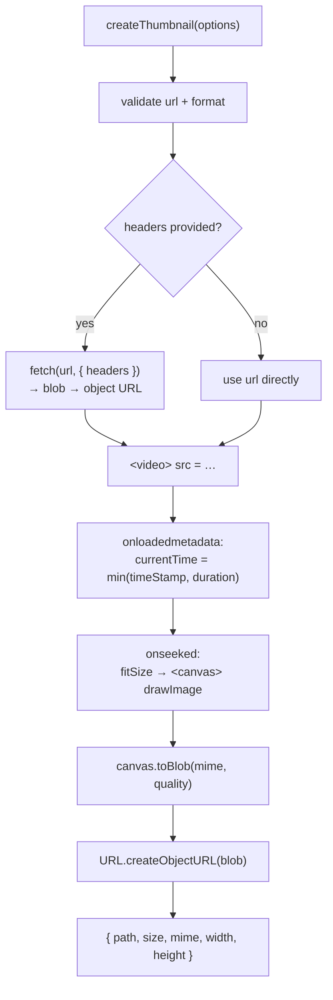

# Web Implementation

> No native module — just the DOM. `<video>` to seek, `<canvas>` to capture,
> `toBlob` to encode. The same `import`, the same function signature.

**Source:** [`src/index.web.ts`](../../src/index.web.ts)
**Decoder:** the browser's built-in `<video>` element
**Target:** modern browsers (anything with `<canvas>.toBlob`)

---

## How the same import resolves to web code

There is no Nitro layer on web. Instead, **bundler platform-extension
resolution** does the switching: Metro (and Webpack/Vite via `react-native-web`
conventions) prefer a `.web.ts` file over the bare `.ts` when targeting web. So:

```ts
import { createThumbnail } from 'react-native-nitro-thumbnail';
```

resolves to [`src/index.ts`](../../src/index.ts) on iOS/Android and to
[`src/index.web.ts`](../../src/index.web.ts) on web — automatically, with **no
code change on your side**. Both files export an identically-typed
`createThumbnail`, so your call sites are platform-agnostic.

---

## The pipeline



---

## Headers require a manual fetch

A bare `<video src>` can't carry custom request headers. So when you pass
`headers`, the web implementation fetches the bytes itself, wraps them in a blob,
and points the `<video>` at the resulting object URL:

```ts
if (options.headers && Object.keys(options.headers).length > 0) {
  let resp: Response;
  try {
    resp = await fetch(options.url, { headers: options.headers });
  } catch (e) {
    throw new ThumbnailError('REMOTE_FETCH_FAILED', `Failed to fetch video: ${…}`);
  }
  if (!resp.ok) throw new ThumbnailError('REMOTE_FETCH_FAILED', `HTTP ${resp.status} …`);
  const blob = await resp.blob();
  fetchedUrl = URL.createObjectURL(blob);   // revoked in a finally
  src = fetchedUrl;
}
```

The temporary object URL is **revoked in a `finally`** so it doesn't leak. Without
`headers`, the URL is handed straight to the `<video>` and the browser streams it.

---

## Seeking and capturing

```ts
const video = document.createElement('video');
video.preload = 'auto';
video.muted = true;
video.crossOrigin = 'anonymous';   // needed so the canvas isn't "tainted"

video.onloadedmetadata = () => {
  const dur = video.duration || timeStampMs / 1000;
  video.currentTime = Math.min(timeStampMs / 1000, dur);   // seek (s)
};

video.onseeked = () => {
  const { width, height } = fitSize(video.videoWidth, video.videoHeight, maxWidth, maxHeight);
  const canvas = document.createElement('canvas');
  canvas.width = width; canvas.height = height;
  canvas.getContext('2d').drawImage(video, 0, 0, width, height);
  canvas.toBlob(blob => resolve({ path: URL.createObjectURL(blob), size: blob.size, mime, width, height }), mime, quality);
};

video.src = src;
video.load();
```

Key points:

- **`crossOrigin = 'anonymous'`** — without it, drawing a cross-origin video onto
  a canvas "taints" the canvas and `toBlob` throws a security error. The remote
  server must also send permissive CORS headers (`Access-Control-Allow-Origin`).
- **`timeStamp` is milliseconds in the API but `currentTime` is seconds** — the
  code divides by 1000 and clamps to the video's `duration`.
- **`fitSize`** is the same aspect-fit-never-upscale math as the native platforms,
  exported as a pure function (and unit-tested):

  ```ts
  const scale = Math.min(maxW / naturalW, maxH / naturalH, 1);
  ```

- **`quality`** is passed through to `canvas.toBlob` for JPEG; PNG ignores it.

---

## Result & cleanup

The result `path` is a **blob object URL** (`blob:…`), not a file path. It lives
in memory for the lifetime of the document unless you free it:

```ts
const thumb = await createThumbnail({ url });
img.src = thumb.path;
// later, when you're done displaying it:
URL.revokeObjectURL(thumb.path);
```

> **`cacheName` and `dirSize` are no-ops on web.** There's no managed disk cache —
> every call produces a fresh in-memory object URL. If you need to avoid repeated
> work, memoize results in your own app state keyed by URL + timestamp.

---

## Error mapping

| Code | Cause on web |
|---|---|
| `INVALID_URL` | empty / non-string `url` |
| `UNSUPPORTED_FORMAT` | `format` other than `'jpeg'`/`'png'` |
| `REMOTE_FETCH_FAILED` | `fetch` rejects, or a non-2xx response (when `headers` used) |
| `DECODE_FAILED` | `<video>` `onerror`, or no 2D canvas context |
| `WRITE_FAILED` | `canvas.toBlob` yields `null` |

These mirror the native codes exactly, so cross-platform error handling code
works unchanged. See [error handling](../error-handling.md).

---

## Testing

The web path is unit-tested under jsdom in
[`__tests__/web.test.ts`](../../__tests__/web.test.ts), with lightweight fakes for
`<video>`/`<canvas>` (jsdom doesn't implement media decoding). The tests cover the
happy path, the drop-in default export, and each error mapping.
