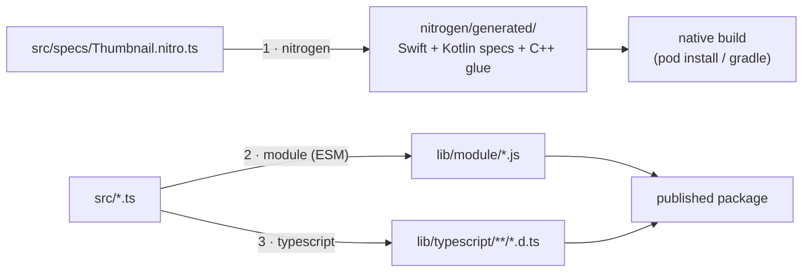

import { Callout } from 'nextra/components'

# Internals & Contributing

<Callout type="info">
How the package is built, how the pieces fit on disk, and how to make a change
with confidence. If you want to contribute, start here.
</Callout>

For the day-to-day workflow commands (running the example app on a device,
linting), see [`CONTRIBUTING.md`](https://github.com/pythonsst/react-native-nitro-thumbnail/blob/main/CONTRIBUTING.md). This document is the
**mental model** behind those commands.

---

## Repository layout

```
react-native-nitro-thumbnail/
├── src/                          # TypeScript — the only code you import
│   ├── index.ts                  # public createThumbnail (native platforms)
│   ├── index.web.ts              # public createThumbnail (web, pure DOM)
│   ├── types.ts                  # CreateThumbnailOptions, Thumbnail, error codes
│   ├── errors.ts                 # ThumbnailError + toThumbnailError (code parsing)
│   ├── native.ts                 # lazy HybridObject accessor
│   └── specs/
│       └── Thumbnail.nitro.ts    # ← the JS↔native contract (nitrogen input)
│
├── ios/
│   ├── HybridThumbnail.swift     # AVFoundation implementation
│   ├── ThumbnailEncoder.swift    # pure sizing/encoding/eviction helpers
│   └── Tests/                    # XCTest for the pure helpers (not shipped)
│
├── android/src/
│   ├── main/.../HybridThumbnail.kt       # MediaMetadataRetriever implementation
│   ├── main/.../ThumbnailEncoderKt.kt    # pure sizing/encoding/eviction helpers
│   ├── main/.../NitroThumbnailPackage.kt # autolinking package
│   └── test/.../*.kt                     # JUnit for the pure helpers (not shipped)
│
├── __tests__/                    # Jest (node + jsdom) for the TS layer
├── example/                      # runnable demo app (Yarn workspace)
├── docs/                         # ← you are here
├── nitrogen/                     # GENERATED by nitrogen (gitignored, built on prepare)
├── lib/                          # GENERATED by bob (the published JS/types)
│
├── Thumbnail spec & config
│   ├── nitro.json                # nitrogen config: module names, autolinking map
│   ├── NitroThumbnail.podspec    # iOS pod definition
│   └── package.json              # bob build targets, scripts, deps
```

The rule of thumb: **`src/` is the contract, `ios/` + `android/` implement it,
`nitrogen/` + `lib/` are generated and never hand-edited.**

---

## The build pipeline

The package is built by [react-native-builder-bob](https://github.com/callstack/react-native-builder-bob)
("bob"), driven by `yarn prepare` (which npm/yarn run automatically on install
and publish). Bob runs three targets in order:



1. **`nitrogen`** (custom target) reads every `*.nitro.ts` spec and generates the
   native `HybridThumbnailSpec` protocol (Swift), abstract class (Kotlin), and the
   C++ JSI bindings into `nitrogen/generated/`. **You implement the generated
   spec — you never write the bridge by hand.**
2. **`module`** transpiles `src/` to ESM JavaScript in `lib/module/`.
3. **`typescript`** emits `.d.ts` declarations to `lib/typescript/`.

`package.json` points consumers at the generated outputs:

```jsonc
"main":  "./lib/module/index.js",
"types": "./lib/typescript/src/index.d.ts",
```

### When to re-run nitrogen

Run `yarn nitrogen` whenever you:

- change `src/specs/Thumbnail.nitro.ts` (new method, new field, new type), or
- build the project for the first time (the generated files are **not**
  committed).

The native code won't compile against an out-of-date generated spec — that's the
point. The spec is the single source of truth, and codegen keeps both native
sides honest.

---

## Testing strategy

The library is tested at three levels, matching the three layers of the
[architecture](/guides/architecture). The principle throughout: **extract the pure
logic so it can be tested without a device.**

| Layer | What's tested | How | Where |
|---|---|---|---|
| TS public API | validation, defaults, error mapping, web pipeline | Jest (node + jsdom) | [`__tests__/`](https://github.com/pythonsst/react-native-nitro-thumbnail/tree/main/__tests__) |
| iOS pure helpers | `targetSize`, `encode`, `filesToEvict` | XCTest / SwiftPM | `ios/Tests/` |
| Android pure helpers | `targetSize`, `mimeFor`, `encode`, `filesToEvict` | JUnit | `android/src/test/` |
| End-to-end | real decode on real media | example app | [`example/`](https://github.com/pythonsst/react-native-nitro-thumbnail/tree/main/example) |

```sh
yarn test          # Jest — the TypeScript layer
yarn typecheck     # tsc, no emit
yarn lint          # eslint
```

The Jest suite covers `createThumbnail` validation/defaults, `toThumbnailError`
parsing (including the `[CODE]` prefix and the `funcName:` wrapper), and the full
web `<video>`/`<canvas>` path with jsdom fakes. The native helper tests cover the
sizing math and LRU eviction with hand-built inputs — no video files required.

Why split pure helpers out (`ThumbnailEncoder.swift`,
`ThumbnailEncoderKt.kt`, `fitSize`)? Because the interesting logic — aspect-fit
math and eviction ordering — has nothing to do with AVFoundation or
`MediaMetadataRetriever`. Pulling it into side-effect-free functions makes it
fast and deterministic to test, and keeps the platform classes thin.

---

## Making a change: worked examples

**Add a new option (e.g. `backgroundColor`)**

1. Add it to `CreateThumbnailOptions` in [`src/types.ts`](https://github.com/pythonsst/react-native-nitro-thumbnail/blob/main/src/types.ts) and to
   `NativeThumbnailOptions` in [`src/specs/Thumbnail.nitro.ts`](https://github.com/pythonsst/react-native-nitro-thumbnail/blob/main/src/specs/Thumbnail.nitro.ts).
2. Normalize/default it in [`src/index.ts`](https://github.com/pythonsst/react-native-nitro-thumbnail/blob/main/src/index.ts) (and `index.web.ts`).
3. `yarn nitrogen` to regenerate the native specs.
4. Implement it in `HybridThumbnail.swift`, `HybridThumbnail.kt`, and the web path.
5. Add Jest tests for the TS normalization; add native tests if it touches the
   pure helpers.
6. Verify in the example app on a simulator/emulator.

**Fix the sizing math**

Edit only the pure helpers (`targetSize` / `fitSize`) and their unit tests — no
device needed. The platform classes call into them unchanged.

**Add an error code**

1. Add it to the `ThumbnailErrorCode` union *and* `THUMBNAIL_ERROR_CODES` array in
   [`src/types.ts`](https://github.com/pythonsst/react-native-nitro-thumbnail/blob/main/src/types.ts) (both — the array is the runtime allow-list
   `toThumbnailError` checks against).
2. Throw it from native via the `err("NEW_CODE", …)` helper, or from the web/TS
   path via `new ThumbnailError('NEW_CODE', …)`.
3. Add a Jest test asserting it round-trips.
4. Document it in the [Error Handling guide](/guides/error-handling) and the
   [API reference](/guides/api-reference).

---

## Coding conventions

- **Validate in TypeScript, act dumbly in native.** Don't push input validation
  into Swift/Kotlin — the native side should receive a complete, normalized
  struct. (See [architecture → design principles](/guides/architecture#design-principles).)
- **Keep pure logic pure.** Sizing/eviction/encoding decisions go in the
  `*Encoder*` helpers, free of I/O, so they stay unit-testable.
- **One code path per error.** Every failure maps to exactly one
  `ThumbnailErrorCode`; encode it at the throw site with the `err()` helper.
- **Match the surrounding style.** Prettier + ESLint configs are in the repo; run
  `yarn lint --fix` before committing.

---

## Contributing checklist

- [ ] `yarn` to install (uses Yarn 4 workspaces — not npm)
- [ ] `yarn nitrogen` if you touched a `*.nitro.ts` spec
- [ ] `yarn test`, `yarn typecheck`, `yarn lint` all green
- [ ] New behavior has tests (pure helpers where possible)
- [ ] Verified in the [example app](https://github.com/pythonsst/react-native-nitro-thumbnail/tree/main/example) if native code changed
- [ ] Docs updated ([API reference](/guides/api-reference) / relevant guide)
- [ ] Small, focused PR — discuss API/implementation changes in an issue first

Friendly reminder: the [code of conduct](https://github.com/pythonsst/react-native-nitro-thumbnail/blob/main/CODE_OF_CONDUCT.md) applies to all
interactions. New contributors are genuinely welcome — a good first PR is fixing
or extending a doc you found confusing while reading these.
