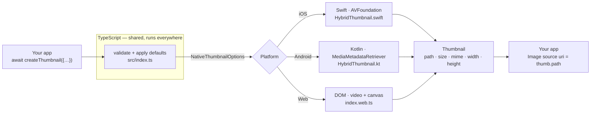
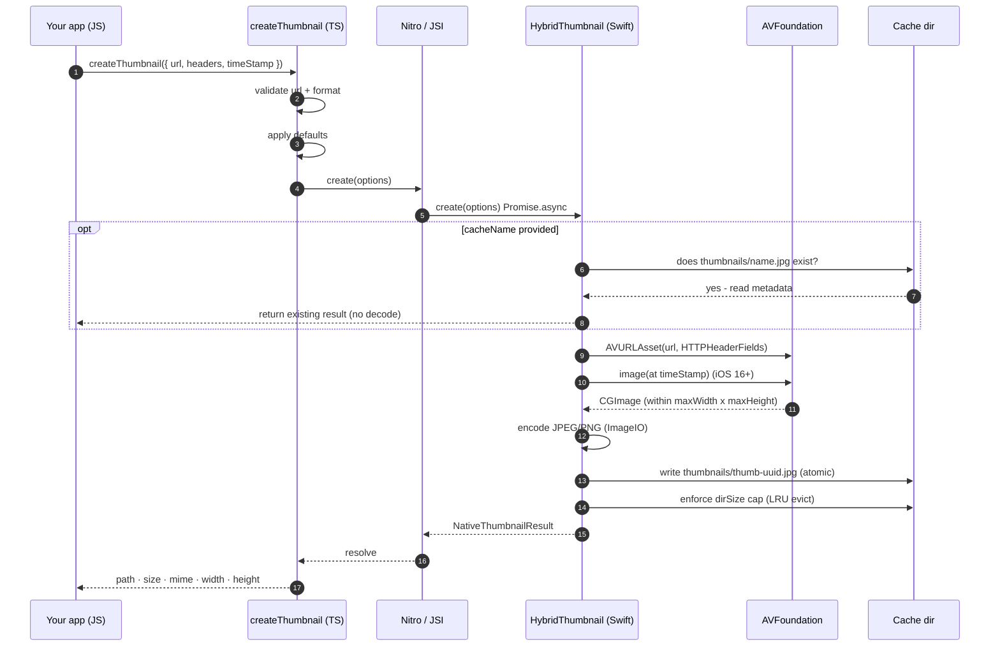

import { Callout } from 'nextra/components'

# Architecture

How a single `createThumbnail()` call becomes a decoded video frame on three very
different platforms — and why the library is built the way it is.

<Callout type="info" emoji="🧭">
If you only read one design doc, read this one. Everything else
([Caching](/guides/caching), [Error Handling](/guides/error-handling), the
platform guides) is a zoom-in on a box you'll meet here.
</Callout>

## The one-paragraph version

There is **one** public function — `createThumbnail(options)` — written in TypeScript.
It validates input and fills in defaults, then hands a fully-formed options object to a
Nitro [`HybridObject`](https://nitro.margelo.com/docs/hybrid-objects). That HybridObject
is implemented in **Swift** on iOS, **Kotlin** on Android, and **plain DOM APIs** on
Web. Each implementation decodes a frame using the best native API for its platform,
encodes it to JPEG/PNG, and returns a small, identical result object. Errors from any
layer are funnelled back into a single typed `ThumbnailError`.



The promise of the library: **the box labelled "Your app" never changes**. Only the
middle box changes per platform, and you never see it.

## Why Nitro?

React Native has historically bridged JS ↔ native through an asynchronous,
JSON-serialised "bridge". [Nitro Modules](https://nitro.margelo.com/) replaces that with
JSI-backed `HybridObject`s: typed, synchronous-capable, codegen'd objects that call
straight into Swift/Kotlin with no serialization tax.

| Concern | Old bridge | Nitro |
| --- | --- | --- |
| **Type safety** | hand-written, drifts | generated from one `.nitro.ts` spec |
| **Language** | Obj-C / Java glue | pure **Swift** / **Kotlin** |
| **Marshalling** | JSON serialize both ways | direct JSI, zero-copy where possible |
| **Architecture** | old + new | **New Architecture only** |

The trade-off — deliberate — is that the library is **New-Architecture-only** and
requires `react-native-nitro-modules` as a peer dependency.

## The four layers

### 1. The public API (TypeScript, shared)

[`src/index.ts`](https://github.com/pythonsst/react-native-nitro-thumbnail/blob/main/src/index.ts)
is the only entry point. It does three things, in order:

1. **Validates** the inputs that are cheap to check in JS — `url` must be a non-empty
   string (`INVALID_URL`), `format` must be `'jpeg'` or `'png'` (`UNSUPPORTED_FORMAT`).
   Failing fast here means a malformed call never crosses into native code.
2. **Applies defaults**, producing a `NativeThumbnailOptions` object where every field is
   present and normalized (e.g. `quality` clamped to `0..1`, `timeStamp` defaults to
   `0`). Native code never has to reason about `undefined`.
3. **Delegates** to `getThumbnailNative().create(normalized)` and wraps any rejection in
   `toThumbnailError`.

<Callout type="info" emoji="💡">
**Why normalize in JS and not native?** Defaults written once in TypeScript can't drift
between iOS and Android. The native side stays dumb and deterministic: it receives a
complete struct and acts on it.
</Callout>

### 2. The Nitro spec (the contract)

[`src/specs/Thumbnail.nitro.ts`](https://github.com/pythonsst/react-native-nitro-thumbnail/blob/main/src/specs/Thumbnail.nitro.ts)
is the single source of truth for the JS↔native boundary:

```ts
export interface Thumbnail extends HybridObject<{ ios: 'swift'; android: 'kotlin' }> {
  create(options: NativeThumbnailOptions): Promise<NativeThumbnailResult>;
}
```

Running `nitrogen` over this file generates the Swift `HybridThumbnailSpec` protocol, the
Kotlin `HybridThumbnailSpec` abstract class, and the C++ glue that wires them to JSI.
**You implement the generated spec; you never write the bridge.**

### 3. The native implementations (per platform)

| Platform | File | Decoder |
| --- | --- | --- |
| iOS | [`ios/HybridThumbnail.swift`](https://github.com/pythonsst/react-native-nitro-thumbnail/blob/main/ios/HybridThumbnail.swift) | `AVAssetImageGenerator` |
| Android | [`HybridThumbnail.kt`](https://github.com/pythonsst/react-native-nitro-thumbnail/blob/main/android/src/main/java/com/margelo/nitro/nitrothumbnail/HybridThumbnail.kt) | `MediaMetadataRetriever` |
| Web | [`src/index.web.ts`](https://github.com/pythonsst/react-native-nitro-thumbnail/blob/main/src/index.web.ts) | `<video>` → `<canvas>` |

They share a common shape of work — **dedup → open → decode → encode → write → evict** —
explored below and in each platform guide.

<Callout type="info" emoji="🌐">
**How does Web fit in?** Web has no Nitro layer. Metro's platform-extension resolution
picks `index.web.ts` over `index.ts` when bundling for web, so the *same import* resolves
to a pure-DOM implementation with a byte-for-byte identical signature.
</Callout>

### 4. Error normalization (shared)

Nitro surfaces only an error **message string** to JS. So the native side encodes the
error code as a `[CODE] message` prefix, and
[`src/errors.ts`](https://github.com/pythonsst/react-native-nitro-thumbnail/blob/main/src/errors.ts)
parses it back into a typed `ThumbnailError`. This gets [its own
page](/guides/error-handling).

## The request lifecycle

A complete successful call to a **remote** video on **iOS**, end to end. Other platforms
follow the same beats with different native calls.



Read the beats as the contract each platform upholds: cheap JS validation, a cache
short-circuit, open + decode at the requested timestamp (scaled down to fit, never
upscaled), encode, write atomically, evict the oldest if over the `dirSize` cap, then
resolve with a small plain object.

## Design principles

<Callout type="default" emoji="📐">
These are the invariants the whole codebase is organized around. If you send a PR, this
is what review will hold it to.
</Callout>

- **One API, three engines.** The public surface is defined once. Platform code is an
  implementation detail that must never leak into the type signatures.
- **Validate early, act dumbly.** All input validation lives in TypeScript. Native code
  receives a complete, normalized struct and executes it without branching on missing
  values.
- **Pure logic is extracted and unit-tested.** Sizing math and LRU eviction live in
  side-effect-free helpers, so they can be tested without a device, simulator, or video.
- **Never upscale.** A thumbnail is always within `maxWidth × maxHeight`; small source
  videos are returned at native size. The `width`/`height` in the result are the *actual*
  output dimensions.
- **Typed failure, never a silent one.** Every failure path maps to one of seven
  [`ThumbnailErrorCode`](/guides/error-handling#the-error-codes)s.

## Where to go next

- [API Reference](/guides/api-reference) — every option and result field.
- [Error Handling](/guides/error-handling) — the `[CODE]` bridging trick in detail.
- [Caching](/guides/caching) — dedup and LRU eviction internals.
- Platform guides — [iOS](/platforms/ios) · [Android](/platforms/android) · [Web](/platforms/web).
- [Contributing](/contributing) — the build pipeline and how to hack on it.
