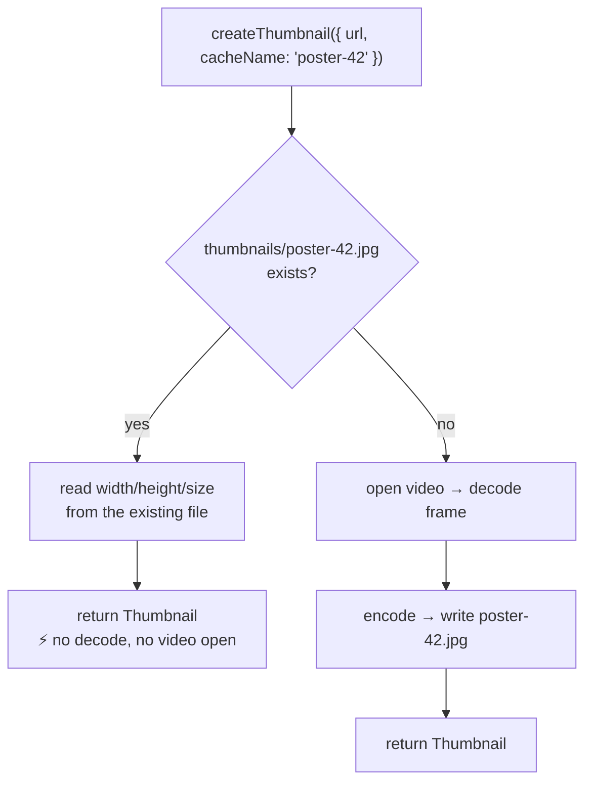
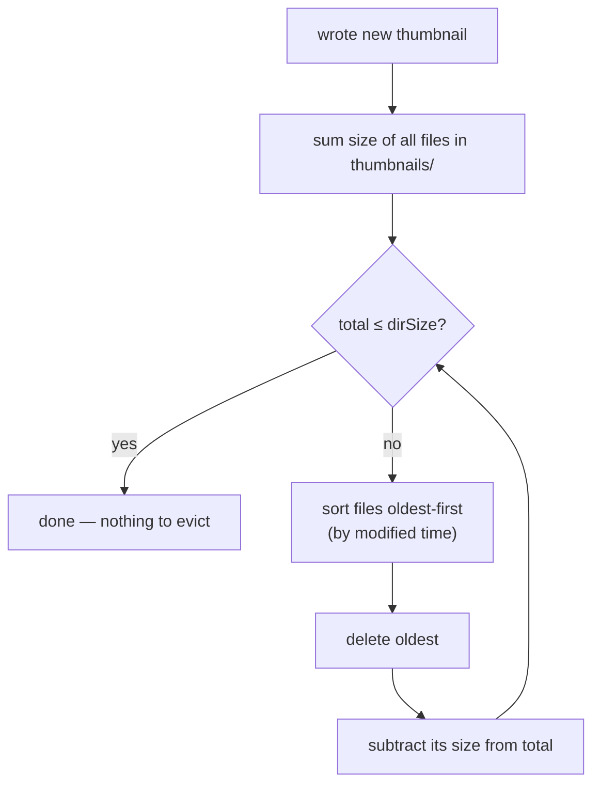

import { Callout } from 'nextra/components'

# Caching

<Callout type="info">
Two independent mechanisms — **deduplication** (`cacheName`) and **bounded
growth** (`dirSize`) — that let you decode a frame once and never worry about
the cache filling a user's disk.
</Callout>

Decoding a video frame is expensive: it means opening a container, seeking, and
decoding at least one frame. The cache exists so you pay that cost **at most
once** per logical thumbnail, and so the bytes you write never grow unbounded.

<Callout type="warning">
**Native only.** Everything on this page applies to **iOS and Android**. On
**Web** there is no managed disk cache — `cacheName` and `dirSize` are accepted
but ignored, and every call returns a fresh in-memory object URL. See the
[Web guide](/platforms/web).
</Callout>

---

## Where thumbnails live

All thumbnails are written to a `thumbnails/` subfolder of the platform cache
directory:

| Platform | Directory |
|---|---|
| iOS | `…/Library/Caches/thumbnails/` (via `FileManager .cachesDirectory`) |
| Android | `<context.cacheDir>/thumbnails/` |

The cache directory is the right home for these: the OS may reclaim it under
storage pressure, and it isn't backed up — exactly the semantics you want for
regenerable derived data.

Filenames are one of two shapes:

- **`thumb-<uuid>.jpg`** — the default. Every call without a `cacheName` produces
  a unique file.
- **`<cacheName>.jpg`** — deterministic. This is what makes deduplication
  possible.

(The extension is `.png` when `format: 'png'`.)

---

## Mechanism 1 — Deduplication with `cacheName`

When you pass a `cacheName`, the output filename becomes deterministic. Before
doing **any** decoding work, the native side checks whether that file already
exists — and if it does, it reads back its metadata and returns immediately.



The existence check is cheap and reads only the image header — it does **not**
re-decode the video:

- **iOS** uses `CGImageSourceCreateWithURL` + `CGImageSourceCopyPropertiesAtIndex`
  to read the pixel dimensions from the file's metadata.
- **Android** uses `BitmapFactory` with `inJustDecodeBounds = true`, which reads
  the dimensions without allocating the pixel buffer.

### Using it well

Pick a `cacheName` that is **stable for the logical thumbnail you want** and
**unique across different thumbnails**. A good key encodes everything that would
change the output:

```ts
// Good: distinct videos and distinct timestamps get distinct files
const name = `v-${videoId}-t${timeStamp}`;
await createThumbnail({ url, timeStamp, cacheName: name });
```

```ts
// Risky: same name for different frames → the first one "wins" forever
await createThumbnail({ url, timeStamp: 1000, cacheName: 'poster' });
await createThumbnail({ url, timeStamp: 5000, cacheName: 'poster' });
// ^ returns the 1000ms frame again — the file already exists!
```

<Callout type="warning">
**The dedup is by filename, not by content.** It does not inspect `timeStamp`,
`maxWidth`, `format`, etc. If any of those change the desired output, encode
them into the `cacheName`. Conversely, if you *want* to force a re-decode,
change the name (or delete the file).
</Callout>

### Lifecycle of a cached poster

```ts
// First call: decodes, writes thumbnails/poster-42.jpg, returns it
const a = await createThumbnail({ url, cacheName: 'poster-42' });

// Later calls (even after app restart): instant, no decode
const b = await createThumbnail({ url, cacheName: 'poster-42' });
// a.path === b.path, and b cost ~nothing
```

---

## Mechanism 2 — Bounded growth with `dirSize`

Left unchecked, a thumbnail folder grows forever. `dirSize` caps it. After every
successful write, the library measures the `thumbnails/` folder and, if it's over
the cap, deletes the **oldest** files (by last-modified time) until it's back
under — a classic **LRU eviction**.

- `dirSize` is in **megabytes**. Default: **100**.
- A value `<= 0` disables eviction entirely (unbounded).
- Eviction runs *after* the new thumbnail is written, so the file you just
  created is the newest and won't be the one evicted (unless it alone exceeds the
  cap).



### The eviction logic is pure and tested

The decision of *which* files to delete is a side-effect-free function that takes
`(path, size, modifiedTime)` tuples and a byte cap, and returns the list of paths
to remove. It lives apart from the filesystem code specifically so it can be
unit-tested without writing real files:

- iOS: `ThumbnailEncoder.filesToEvict(_:capBytes:)` —
  [`ios/ThumbnailEncoder.swift`](https://github.com/pythonsst/react-native-nitro-thumbnail/blob/main/ios/ThumbnailEncoder.swift), tested in `ios/Tests`.
- Android: `ThumbnailEncoderKt.filesToEvict(entries, capBytes)` —
  [`ThumbnailEncoderKt.kt`](https://github.com/pythonsst/react-native-nitro-thumbnail/blob/main/android/src/main/java/com/margelo/nitro/nitrothumbnail/ThumbnailEncoderKt.kt),
  tested in `ThumbnailEvictionTest.kt`.

Both implement the same algorithm:

```
total = sum(sizes)
if total <= cap: return []          # nothing to do
for file in (oldest first):
    if total <= cap: break
    delete file; total -= file.size
```

The surrounding native method only does the I/O: list the directory, gather
`(size, mtime)` for each file, call `filesToEvict`, and `removeItem`/`delete` the
returned paths.

---

## How the two mechanisms compose

They're orthogonal and complementary:

- **`cacheName`** decides *whether you decode at all* (skip the work if the named
  file exists).
- **`dirSize`** decides *how long files survive* (evict the oldest when the folder
  grows past the cap).

A subtle interaction worth knowing: a `cacheName`'d file is still a normal file in
the folder, so **it can be evicted by `dirSize` pressure** if it becomes the
oldest. If that happens, the next call with that `cacheName` simply finds no file
and re-decodes — correct, just not free. If you have posters that must never be
re-decoded, give them a generous `dirSize` or a separate strategy.

---

## Practical guidance

- **List thumbnails (poster grid):** use `cacheName` keyed by item id so each row
  decodes once and scrolling is instant on revisits.
- **One-off share/preview:** skip `cacheName`; let it write a `thumb-<uuid>` file
  and rely on `dirSize` to clean up later.
- **Tight on storage:** lower `dirSize` (e.g. `20`). Eviction keeps the most
  recently produced thumbnails.
- **Need a hard guarantee a file persists:** the cache directory is OS-reclaimable
  by design — if a thumbnail must survive indefinitely, copy `thumb.path` into your
  own documents directory after generating it.
