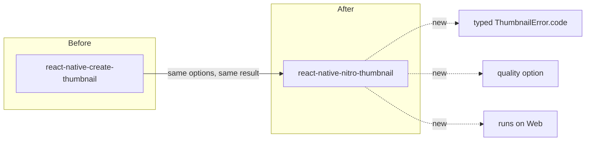

import { Callout } from 'nextra/components'

# Migrating from `react-native-create-thumbnail`

<Callout type="info">
In most apps the switch is a one-line import change. This guide covers the
happy path and the handful of differences worth knowing.
</Callout>

`react-native-nitro-thumbnail` is designed as a **drop-in replacement** for
[`react-native-create-thumbnail`](https://www.npmjs.com/package/react-native-create-thumbnail):
the function name, options, result shape, defaults, **and** the dual
named/default export all match.

---

## The one-line change

```diff
- import { createThumbnail } from 'react-native-create-thumbnail';
+ import { createThumbnail } from 'react-native-nitro-thumbnail';
```

The default-import style works too, so this keeps working as well:

```diff
- import CreateThumbnail from 'react-native-create-thumbnail';
+ import CreateThumbnail from 'react-native-nitro-thumbnail';
  CreateThumbnail.createThumbnail({ url });
```

Then install the Nitro runtime peer dependency and rebuild (see
[What you must change](#what-you-must-change)).

---

## What stays the same

- **The call.** `createThumbnail(config): Promise<{ path, size, mime, width, height }>`
  is identical.
- **The options.** `url`, `timeStamp`, `format`, `maxWidth`, `maxHeight`,
  `dirSize`, `cacheName`, `headers`, `timeToleranceMs`, `onlySyncedFrames` all
  match by **name and default value**.
- **The result fields.** `path`, `size`, `mime`, `width`, `height`.
- **Both import styles.** Named export *and* a default object exposing
  `createThumbnail`.
- **`try/catch`.** Errors are still `Error` instances, so existing handling keeps
  working.



---

## What you must change

These are the only required steps beyond the import:

1. **Install the Nitro runtime.** This library is built on Nitro Modules and
   needs the runtime as a peer dependency:

   ```sh
   npm install react-native-nitro-thumbnail react-native-nitro-modules
   # then, iOS:
   cd ios && pod install
   ```

2. **Be on the New Architecture.** `react-native-nitro-thumbnail` is
   **New-Architecture-only** (RN 0.75+, Fabric/TurboModules enabled). If your app
   still runs the old architecture, you'll need to enable the new one — there is
   no old-arch build.

That's it. No config plugin, no linking step.

---

## Small differences worth knowing

| Area | `react-native-create-thumbnail` | `react-native-nitro-thumbnail` |
|---|---|---|
| **Errors** | reject with an `Error` (string message) | reject with a typed `ThumbnailError` that has a `.code` — still an `Error`, so old `catch` works |
| **`headers` type** | `object` | `Record<string, string>` (stricter — values must be strings) |
| **`quality`** | — | **new** optional JPEG quality (`0..1`, default `0.9`) |
| **Web** | not supported | **supported** via `<video>`/`<canvas>` |
| **Architecture** | old + new | **new only**, requires `react-native-nitro-modules` |

### The `headers` type is stricter

The original typed `headers` as `object`. Here it's `Record<string, string>`,
because the native layers (`AVURLAssetHTTPHeaderFieldsKey` on iOS,
`setDataSource(url, headers)` on Android) require string values anyway. If you
were passing non-string header values, stringify them:

```diff
- headers: { 'X-Count': 42 }
+ headers: { 'X-Count': String(42) }
```

### Errors gain a `.code`

You don't have to change anything — but you *can* now branch on a typed code
instead of matching message strings:

```ts
import { ThumbnailError } from 'react-native-nitro-thumbnail';

try {
  await createThumbnail({ url });
} catch (e) {
  if (e instanceof ThumbnailError && e.code === 'REMOTE_FETCH_FAILED') {
    // offer a retry
  }
}
```

See [error handling](/guides/error-handling) for the full list of codes.

---

## Migration checklist

- [ ] `npm install react-native-nitro-thumbnail react-native-nitro-modules`
- [ ] `cd ios && pod install`
- [ ] Confirm the app runs on the **New Architecture** (RN 0.75+)
- [ ] Update imports (`create-thumbnail` → `nitro-thumbnail`)
- [ ] If you passed non-string `headers` values, stringify them
- [ ] (Optional) Replace message-string error checks with `e.code` checks
- [ ] (Optional) Add `quality` where you want smaller JPEGs
- [ ] Rebuild the app (native code changed) and smoke-test thumbnail generation

If you hit anything that *isn't* covered here, it's a compatibility bug worth
[reporting](https://github.com/pythonsst/react-native-nitro-thumbnail/issues) —
the goal is a genuinely transparent swap.
