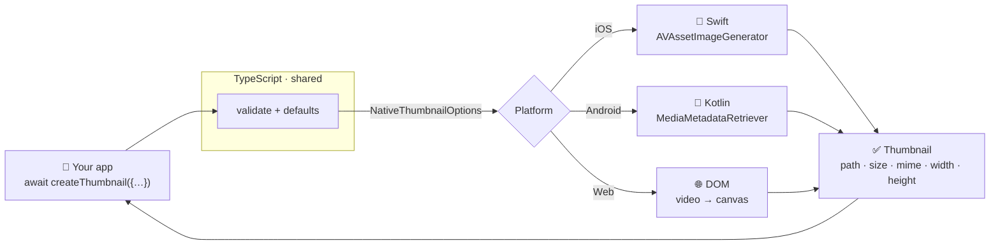

import { Cards, Callout, Steps } from 'nextra/components'

<div style={{ textAlign: 'center', marginTop: '3rem' }}>

# 🎬 react-native-nitro-thumbnail

<p style={{ fontSize: '1.35rem', fontWeight: 600, marginTop: '0.5rem', lineHeight: 1.4 }}>
Generate a thumbnail from <strong>any video</strong> — local or remote — with one async call.
</p>

<p style={{ fontSize: '1.05rem', opacity: 0.8, maxWidth: '640px', margin: '0.5rem auto 1.5rem' }}>
The same API on <strong>iOS</strong>, <strong>Android</strong>, and <strong>Web</strong>.
Powered by <a href="https://nitro.margelo.com/">Nitro</a>: pure Swift &amp; Kotlin,
New Architecture, no bridge.
</p>

[](https://www.npmjs.com/package/react-native-nitro-thumbnail)
[](https://github.com/pythonsst/react-native-nitro-thumbnail/blob/main/LICENSE)
[](/platforms/ios)
[](https://nitro.margelo.com/)

</div>

```ts
import { createThumbnail } from 'react-native-nitro-thumbnail';

const thumb = await createThumbnail({ url: 'https://media.example.com/clip.mp4' });
// → { path: 'file:///…/thumb.jpg', size: 19856, mime: 'image/jpeg', width: 512, height: 288 }

<Image source={{ uri: thumb.path }} />
```

<div style={{ textAlign: 'center', margin: '2rem 0' }}>

**One call, one frame.** Here's a real thumbnail the library extracts from the bundled demo clip:


<p style={{ fontSize: '0.85rem', opacity: 0.6, marginTop: '0.5rem' }}>
Demo: <a href="https://www.sintel.org">Sintel</a> © Blender Foundation, CC-BY 3.0.
</p>

</div>

<Callout type="info" emoji="📦">
**Already published.** `npm install react-native-nitro-thumbnail react-native-nitro-modules` —
then head to [Installation](/getting-started/installation).
</Callout>

## Why this library?

<Cards>
  <Cards.Card icon="🧩" title="One API, three engines" href="/guides/architecture" arrow>
    iOS (AVFoundation), Android (MediaMetadataRetriever), and Web (`<video>` + `<canvas>`)
    behind a single typed function. Your call sites never branch on platform.
  </Cards.Card>
  <Cards.Card icon="🌐" title="Local & remote, no download step" href="/platforms/ios" arrow>
    Pass a `file://` path or an `http(s)` URL. Remote videos are streamed and decoded
    directly. Custom request headers supported.
  </Cards.Card>
  <Cards.Card icon="⚡" title="Built on Nitro" href="/guides/architecture" arrow>
    Pure Swift & Kotlin over JSI — no Objective-C/Java bridge. The native contract is
    generated from one TypeScript spec, so it can't drift.
  </Cards.Card>
  <Cards.Card icon="🎯" title="Typed errors" href="/guides/error-handling" arrow>
    Every failure rejects with a `ThumbnailError` carrying a typed `.code` you can
    `switch` on — never an opaque string.
  </Cards.Card>
  <Cards.Card icon="💾" title="Built-in caching" href="/guides/caching" arrow>
    Deterministic filenames skip re-decoding; a size cap evicts old thumbnails (LRU) so
    the cache never grows unbounded.
  </Cards.Card>
  <Cards.Card icon="🔀" title="Drop-in replacement" href="/guides/migration" arrow>
    Matches `react-native-create-thumbnail`'s options, result, and defaults — migrating
    is usually a one-line import change.
  </Cards.Card>
</Cards>

## How it works

One TypeScript function validates your input and applies defaults, then calls a Nitro
`HybridObject` implemented natively per platform. The box labelled "your app" never
changes — only the engine behind it does.



The complete request lifecycle — cache check, decode, encode, write, evict — is in the
[Architecture](/guides/architecture) guide.

## Get started

<Steps>

### Install

```sh
npm install react-native-nitro-thumbnail react-native-nitro-modules
cd ios && pod install
```

### Call it

```ts
const thumb = await createThumbnail({ url, timeStamp: 2000 });
```

### Render it

```tsx
<Image source={{ uri: thumb.path }} style={{ width: thumb.width, height: thumb.height }} />
```

</Steps>

<Cards>
  <Cards.Card icon="🚀" title="Installation" href="/getting-started/installation" arrow>
    Install, pods, Expo, and the New Architecture requirement.
  </Cards.Card>
  <Cards.Card icon="📖" title="API Reference" href="/guides/api-reference" arrow>
    Every option and result field, with recipes.
  </Cards.Card>
  <Cards.Card icon="🏛️" title="Architecture" href="/guides/architecture" arrow>
    The TS → Nitro → native flow, end to end.
  </Cards.Card>
</Cards>
