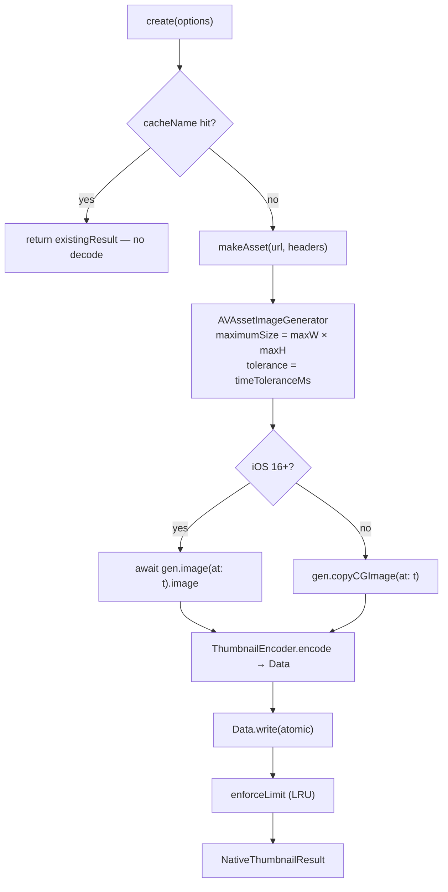

import { Callout } from 'nextra/components'

# iOS Implementation

<Callout type="info">Pure Swift, AVFoundation, ImageIO. No Objective-C glue, no bridge.</Callout>

**Source:** [`ios/HybridThumbnail.swift`](https://github.com/pythonsst/react-native-nitro-thumbnail/blob/main/ios/HybridThumbnail.swift) ·
[`ios/ThumbnailEncoder.swift`](https://github.com/pythonsst/react-native-nitro-thumbnail/blob/main/ios/ThumbnailEncoder.swift)
**Decoder:** `AVAssetImageGenerator`
**Minimum:** iOS 13 (async `image(at:)` used on iOS 16+, `copyCGImage` fallback below)

---

## The pipeline

`HybridThumbnail` conforms to the nitrogen-generated `HybridThumbnailSpec`
protocol. Its single `create` method returns a `Promise.async { … }` so all the
work runs off the JS thread.



---

## Opening the asset

`makeAsset(_:headers:)` turns the `url` string into an `AVURLAsset` and reports
whether it's remote (so errors can be mapped correctly):

```swift
if raw.hasPrefix("http://") || raw.hasPrefix("https://") {
  guard let u = URL(string: raw) else { throw err("INVALID_URL", …) }
  var options: [String: Any] = [:]
  if let headers, !headers.isEmpty {
    options["AVURLAssetHTTPHeaderFieldsKey"] = headers   // ← custom headers
  }
  return (AVURLAsset(url: u, options: options), true)
}
```

- **Remote** (`http(s)://`): an `AVURLAsset` is created with
  `AVURLAssetHTTPHeaderFieldsKey` set to your `headers`. AVFoundation then
  **streams and decodes directly** — there is no separate download step, and the
  whole file is never buffered to disk just to grab one frame.
- **Local** (`file://` or an absolute `/…` path): existence is checked up front
  with `FileManager.fileExists`; a miss throws `FILE_NOT_FOUND` before any decoder
  work.
- **Anything else** throws `INVALID_URL`.

---

## Extracting the frame

```swift
let gen = AVAssetImageGenerator(asset: asset)
gen.appliesPreferredTrackTransform = true               // honor rotation metadata
gen.maximumSize = CGSize(width: maxWidth, height: maxHeight)
gen.requestedTimeToleranceBefore = tol                  // = timeToleranceMs
gen.requestedTimeToleranceAfter  = tol
let time = CMTime(value: timeStamp, timescale: 1000)    // ms → CMTime
```

Three details matter here:

- **`appliesPreferredTrackTransform = true`** — videos carry rotation metadata
  (e.g. portrait clips recorded by phones). This makes the extracted frame come
  out upright instead of sideways.
- **`maximumSize`** — AVFoundation scales *during* decode, so we never
  materialize a full-resolution frame just to shrink it. This is the iOS
  equivalent of Android's `getScaledFrameAtTime`. Aspect ratio is preserved and
  the frame is never upscaled.
- **`requestedTimeTolerance*`** — both set to `timeToleranceMs`. Zero tolerance
  forces an exact (slower) seek; the default 2 s tolerance lets the decoder snap
  to a nearby frame for speed.

### iOS 16+ async vs. the legacy fallback

```swift
if #available(iOS 16.0, *) {
  cg = try await gen.image(at: time).image      // modern async API
} else {
  cg = try gen.copyCGImage(at: time, actualTime: nil)  // iOS 13–15
}
```

On iOS 16+ the library uses the structured-concurrency `image(at:)` API, which
integrates cleanly with the `Promise.async` block and is the path Apple
recommends going forward. On iOS 13–15 it falls back to the synchronous
`copyCGImage(at:)` — same result, older API.

### Error mapping

If extraction throws, the error is inspected to pick the right code:

```swift
let ns = error as NSError
if isRemote && ns.domain == NSURLErrorDomain {
  throw err("REMOTE_FETCH_FAILED", …)   // network problem on a remote asset
}
throw err("DECODE_FAILED", …)           // everything else
```

A networking failure on a remote asset surfaces as `REMOTE_FETCH_FAILED`;
anything else (corrupt media, unsupported codec, timestamp past the end) becomes
`DECODE_FAILED`. See [error handling](/guides/error-handling) for how the `[CODE]`
prefix reaches JS.

---

## Encoding (ImageIO)

`ThumbnailEncoder.encode` is a **pure function** — it takes a `CGImage` and
returns `Data?`, with no filesystem or AVFoundation dependency, so it's unit
tested in isolation (`ios/Tests`).

```swift
let uti = isPng ? UTType.png.identifier : UTType.jpeg.identifier
let dest = CGImageDestinationCreateWithData(data, uti as CFString, 1, nil)
let props = isPng ? [:] : [kCGImageDestinationLossyCompressionQuality: quality]
CGImageDestinationAddImage(dest, image, props as CFDictionary)
return CGImageDestinationFinalize(dest) ? data : nil
```

- **JPEG** honors `quality` (`0..1`) via `kCGImageDestinationLossyCompressionQuality`.
- **PNG** is lossless — `quality` is ignored.
- An unrecognized format returns `nil`, which the caller maps to
  `UNSUPPORTED_FORMAT` (defense in depth — TS already validated it).

---

## Writing & eviction

```swift
try data.write(to: outURL, options: .atomic)   // WRITE_FAILED on throw
enforceLimit(dir: …, capBytes: dirSize * 1024 * 1024)
```

- The write is **atomic** — readers never see a half-written file.
- `outputURL` resolves to `…/Caches/thumbnails/<name>.jpg`, creating the folder
  if needed. `<name>` is your `cacheName` or `thumb-<uuid>`.
- `enforceLimit` lists the directory, gathers `(size, modificationDate)` for each
  file, and delegates the *which-to-delete* decision to the pure
  `ThumbnailEncoder.filesToEvict`. See [caching](/guides/caching).

The returned `width`/`height` are taken from the decoded `CGImage`, i.e. the
**actual** scaled output dimensions.

---

## Building & testing

- The pod is declared in [`NitroThumbnail.podspec`](https://github.com/pythonsst/react-native-nitro-thumbnail/blob/main/NitroThumbnail.podspec);
  `ios/Tests/**` is excluded from the shipped pod.
- Pure-Swift helpers (`ThumbnailEncoder`) are covered by XCTest under `ios/Tests`.
- End-to-end verification runs through the [`example/`](https://github.com/pythonsst/react-native-nitro-thumbnail/tree/main/example) app on a
  simulator/device.

See [internals](/contributing) for the full build pipeline.
